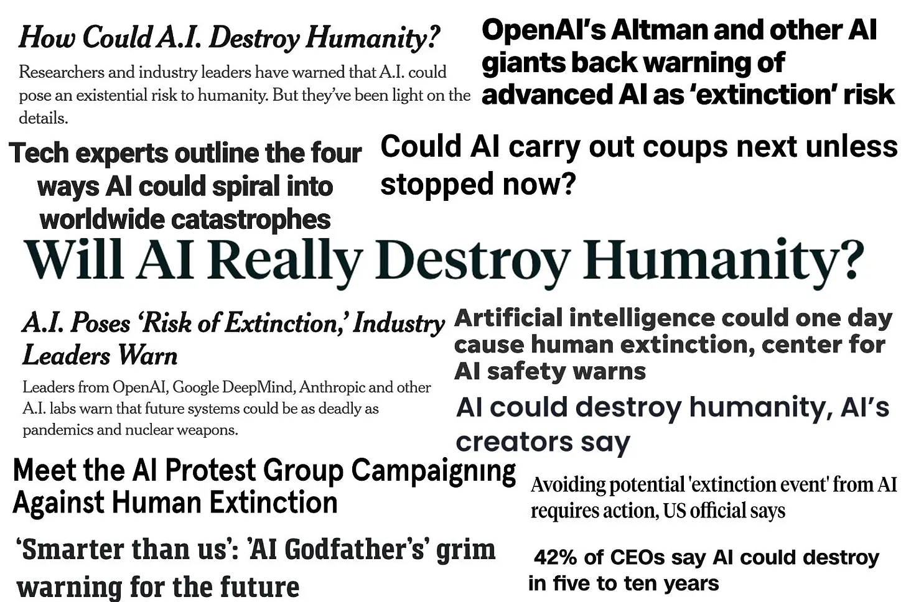

Even being casually aware of frenzy surrounding technological developments, take AI as an example, you are sure to have encountered doomerism. These are pronouncements, predications, and warnings that while these machines are _definitely_ the future, we must be careful lest we open pandora’s box. Hearing this, especially from those who are designing and profiting from these tools, appears a strange conflict of interest; why would anybody talk down their own creations? Perhaps you, like me, might ask a more cynical question: why would you build the very things you warn us about?

These questions are more pressing when you read enough to appreciate what these architects of doom are saying. Here are some examples: On Tuesday, May 30th 2023, a growing list of people working, investing, or involved in artificial intelligence [signed an open letter])(https://aistatement.com/work/statement-on-ai-extinction-risk#open-letter) declaring their work to contain a ‘risk of extinction’ comparable to ‘other societal-scale risks such as pandemics and nuclear war.’ Sam Altman, the CEO of OpenAI the corporation that developed Chat-GPT, told the US Congress that the AI technology [“can go quite wrong”](https://www.wsj.com/tech/ai/chatgpts-sam-altman-faces-senate-panel-examining-artificial-intelligence-4bb6942a#). Christina Montgomery from IBM has echoed these sentiments as well. One reading of these statements praises the responsibility and care on show. Amidst scandal after scandal highlighting the harmful effects of social media on the young (the old, really everybody), reading past pronouncements of social media as building a stronger and wider community comes across at best naive and at worst foolish. Facebook might have played a less than minor role in genocide. At the inception of a new technological development and accompanying industry, perhaps we should commend Sam Altman and others for making clear the risk from artificial intelligence.

This reading answers the first question, by pouring cold water on their industry, they can temper expectations and brace the public for misadventures. It doesn’t quite answer the second question though does it? We’re not talking about spreading disinformation, forcing you to read the ravings of your racist uncle, or even organising hate groups. These are all varying levels of bad but pale in comparison to human extinction. They are also light on details, instead leaning on metaphorical comparisons to nuclear war and pandemics. Chat-GPT is neither a nuclear war head nor the coronavirus (thankfully), so these statements fail at properly educating the non-technical public on the real problems with their technology. Instead what is accomplished is translating and conveying the feeling of doom carried by warheads and viruses and passing it on to artificial intelligence.

In the next few paragraphs, I want to offer an alternate reading of affairs; taking the premise of AI risking human extinction not as a given but as a narrative open to elaboration and dissection. A narrative centered around doom and privileging risk over harm. This essay works as a corollary to my previous on AI discourse so for the sake of valuing your time, I’ll condense ideas better elaborated there.

### Human Extinction and Societal-Scale Risk
I want to begin by examining the examples the open letter does provide and work backwards. Nuclear war does not command the far it did at the height of the Cold War. Despite this, the Russian invasion of Ukraine reminded many, especially in nearby Eurasia, that humanity retains the ability to destroy itself many times over. Key here, is that nuclear war is relatively simple: one nuclear power uses their weapons, another retaliates, and the cockroaches survey the aftermath. Plus, we already have historical evidence of what that might look like, from the two uses of nuclear weapons the world has suffered–Hiroshima and Nagasaki–and the numerous nuclear tests and aftermaths on the people living close-by. There have been close cases in the past that highlight causes outside of total world war; the Cuban missile crisis has become a shorthand for how easily events can spiral till we’re one second from disaster. We have examples of cause (the Cuban missile crisis), event (Hiroshima and Nagasaki), and finally aftermath: you can go online and simulate a range of nuclear weapons on your neighbourhood.

On the contrary, what is the cause, event, and effect of AI carrying a risk of human extinction? No really. We’re given a starting point, rampant development and use of AI tools (point A) and an endpoint, human extinction (point C) but no elaboration of exactly how or why or what happens to get us from A to C. What can be gleaned from public facing cautions of doom is humanity becoming subservient to beings of artificial intelligence as the worst-case scenario and large scale societal upheaval from the systems we now rely on becoming obsolete as the better case. Key here is that these scenarios are simply scenarios; they are fantasies, often evoking (as with optimistic futuristic accounts I discussed in my previous essay) science-fiction stories. It is not lost on me that Skynet, the dystopian AI gone rogue in the Terminator franchise, is often used as an analogy.

Without a clear cause, event, and effect, what is left by cautioning about the risk of AI? I ask this to push back against the reading that these statements by Sam Altman and others deserve praise, attention, and to be taken literally. However, they do deserve to be taken seriously. Let me then return to the question I asked earlier, what is left?

### Doom
Devoid of the specifics other ‘societal-scale’ risks provide, what’s left is the feeling of doom. The dread and apprehension that often invites sleepless nights as you consider a nuclear weapon being used or recalling the upheaval of the pandemic. It is an emotion potent and universal and it is that consequence that best explains why the risk of human extinction is being prophesied by those that might very well release it. What then are the narrative components of doom? I think there are three:
1. High Competence;
2. High Importance, and;
3. Low Urgency.
#### High Competence
What is terrifying about nuclear war is the certainty of destruction. While other forms of warfare are infinitely more common (the word is blessed by never having had a real nuclear war) and thus likelier, they also don’t come with the threat of _total_ annihilation–there remains a possibility of escape, luck or misuse. A gun will almost definitely kill you, yet there is a chance the bullet misses or delivers a non-fatal wound if it does hit. Medical technology has advanced to a position where, if treated quickly enough, you might not die. That possibility, however slim, separates more common and likelier forms of violence from nuclear war. This is also common to pandemics, to be classified as such, the infectious disease must have infected enough people across a large enough area. There can be no easy escape.

All this comes together to portray these examples as having a high competency. They work and that is why we fear them. I highlight competence because it is a narrative useful to any new product. To me, it makes perfect sense to ensure that your product is seen as competent, even if you must terrify the public in the process. Focusing Chat-GPT it and its cousins, other large language models (LLMs), have been criticised for their limitations. They occasionally just don’t work. Famously, Timnit Gebru, prominent AI Ethics researcher, co-authored a paper [‘On the Dangers of Stochastic Parrots: Can Language Models Be Too Big?’](https://dl.acm.org/doi/10.1145/3442188.3445922) outlining the areas where LLMs fall short of their promise. In chasing higher and higher score and larger and larger models, AI scientists produced a model that plays around with linguistic form to imitate successfully understanding language. They are financially and environmentally inefficient (costing more than a regular google search), they carry the risk of reproducing harmful ideologies and biases, and most importantly they mislead both researcher and the public into taking manufactured text as actually meaningful. We read back words and sentences cut up and put together and create a speaker behind the screen. All these concerns contradict the narrative offered that AIs are competent or at least effective enough to merit sharing a comparative sentence with nuclear war and pandemics. The limitations of these models contradict the level of doom encouraged by AI proponents. If nuclear war were inefficient and prone to misleading–both those in the field and the public–about their capabilities, would they still elicit doom?

For another example, the popular forms of COVID conspiracy theory focused on playing down the harms of the virus (and playing up the harms of the vaccine), it was only by throwing cold water on competence could they let go of legitimate fears. Conversely, the primary way to prompt people to take necessary precautions during the pandemic was ensuring they understood the dangers. Competence and doom go hand in hand. It follows then that disenchanting, working to dispel the high-competence narrative, or dissecting areas of concern, harm, and future development is a tightly controlled affair. Timnit Gebru worked on AI ethics at Google, I say worked because after refusing to withdraw the above paper, she was let go. Controlling the narrative of competence remains critically important to ensuring that those who produce AI can guarantee their specific endgame.

#### High Importance
What then is this specific endgame? Here the two other narrative components of doom come into play. To exist in the world of AI doom is to consider the risk of human extinction as the most important topic of discussion. It is a black hole of attention, national and supranational governments must now devote time and energy to the _AI Debate_. Now this doesn’t sound like an issue, for once these governments are being proactive. This should be something worth celebrating and demanding they do more right? To push back on this reading, I ask whom is being centered? It is not primarily AI researchers or ethicists, it is not people who have spent time wondering how to ensure these tools not only work well but have their harms and negative side effects mitigated. It remains, for the most part, CEOs and people intimately tied to tech corporations. Part of this, is the concentration of research in the private sphere, it is not lost on me that Gebru and her other co-workers conducted their research within the Google Campuses. However, the consequence is the same; by peddling the narrative of doom, these industry leaders are able to demand a level of attention.

Consider the mindshare the threat of nuclear weapons held during the height of the Cold War, the importance given to the military, and the orientation of policies to be focused on containing and gaining an advantage over the other side. During the pandemic, people previously unknown became overnight celebrities as everyone working in and around health was given an international audience. Google AI, scan through the headlines on the tech section of your favourite newspaper and you will find journalists repeating the pronouncements of doom; every incremental improvement is suddenly made more important because they hold the risk of human extinction. Many would kill for such free marketing for doom renders the previously mundane meaningful; they capture discourse.

[^1]

Despite this, where AI pales in comparison to nuclear war and pandemics is what is done with this attention.

#### Low Urgency
As the CEOs of AI companies spread the gospel of doom, what do they ask for? On the surface, regulation. Sam Altman has spoken about the need for state-based regulation on chatbots and large language models, which for anybody aware of the libertarian strain that has come out of Silicon Valley is shocking. Entrepreneurs asking for the state to restrain them! Ayn Rand is rolling in her grave.

Looking beyond the surface reveals a less altruistic tale. The regulation requested is akin to a license system, you see OpenAI believe that only they can be trusted and have the required tools and know-how to develop these AI products sustainably and ethically. This is where the contradiction stated earlier is resolved, when Sam Altman and the authors of the open letter talk about the dangers of AI–the risk of human extinction–they imply their products (to gain the advantage of high competence and high importance) but frame it in such a way that the real danger is yet to come. Since AI is so useful, but AI can also be bad, OpenAI wishes for states to give them their seal of approval while stifling other similar products from existing for their potential harm. Not from them, perhaps because they’re good and trustworthy and open, but from other bad actors. This license is akin to the favoured supplier of the monarch. 

Before the industrial revolution, the monarch might designate a corporation the exclusive right to use certain tools or run certain industries. We have modern alternatives in national airlines. The benefit of this system is obvious, as a favoured corporation, you have no competition. You’re able to profit from a market where you’re the only fish in the sea. Will this happen? I doubt it, they’re trying but it is unlikely. What is more probable is a series of criteria an AI company would have to comply with to be allowed to operate. Think of this like a food safety rating. However, this is where the low urgency comes into play. By ramping up the importance but placing the danger in some far off probable and in truth fantastical future, there is time to work on what the license would require. Who is available to shape this? Why the very people who have captured the attention, who have been positioning themselves as the experts in this field, and have made themselves available to talk to all the public bodies they can get. 

By being part of the conversation, Sam Altman and others can shape the requirements mandated, shape it so that they will be the only one of the few able to comply with it. This parallels how data privacy rules, despite being ostensibly targeted at large companies, are disproportionately onerous to smaller companies. Having more money unfortunately does that to you. What is left, therefore, is a situation where these rules make it difficult for smaller companies to enter a field and compete. By shaping the rules of the game you can rig it so that you’re the only ones able to actually play; the market becomes a natural monopoly. I believe this is the endgame for AI doomerism, evidenced by [OpenAI lobbying the EU to mitigate stricter AI regulations](https://www.theverge.com/2023/6/20/23767053/openai-lobbied-eu-ai-act-artificial-intelligence-regulations).[^2]
___
There we go, this reading, that cautions of doom and societal-scale risks are neither accurate nor altruistic. Instead, they are corporations ensuring their products are seen as competent, that they are important, and that they can shape the future of their market to their advantage; it’s not gospel its marketing. This reading might seem pessimistic, the rich getting richer, but all is not bleak. I think it is possible to harness the attention given to the industry and point is somewhere else; away from risks and to harms.

### A Blueprint for Action
What is to be done? That’s the question I keep returning to as saying AI won’t almost definitely cause human extinction is like telling you not to think about polar bears; you can’t get the fuzzy fella out of your mind. In writing this essay, I spoke to friends who were not technical but had played around with various AI products for work, for fun, or somewhere in between. Despite not being able to tell me how we get from here to doom, they remained adamant that the risk would only grow as these products get better. The problem of self-learning AI (despite chat bots getting worse as they train on their own output) or of ‘better code’ (what that means, nobody knows) or better investment creating better output (once again Gebru’s paper on larger models not equaling models is instructive) remained hard to dislodge. Maybe we really have opened pandora’s box and the doomongers have won. This is where I’m supposed to provide a little hope no? Not exactly.

If this diagnosis has accomplished anything it has been to show that the problem has come from scale; doom is created by making the problems and complexities of AI so vast they become incomprehensible and then frightening. If that world is too big, we must make it small; focusing on what we know and the problems we can identify. In doing so, the energy and attention that has been whipped up around the field can be pointed somewhere useful. Inspired by the John Maynard Keynes quote that ‘in the long run we are all dead’ we must stop considering what AI will do, or might do, when it is better or in the decades to come. Instead we ask, what has AI actually done? We look to the tangible harms and work backwards from there.

There is the problem of fabrication, where a chatbot asked a question unanswerable within its training data, spits out a random but coherent answer. Even in its launch demo, [Microsoft’s Bing chatbot made several factual errors](https://www.cnbc.com/2023/02/14/microsoft-bing-ai-made-several-errors-in-launch-demo-last-week-.html). To maintain and prune these answers, workers are [paid a pittance](https://futurism.com/openai-paid-people-developing-world-bestiality), often in the global south, in their moderating jobs. Large language models are expensive and environmentally harmful, they steal for their training data the work of real people, and [plenty of times they just aren’t very good](https://www.youtube.com/watch?v=aC99lNQdNmA). Focusing on all these harms has the triple effect of exposing the limited competence of these chatbots, realigning what should hold our importance, and how urgent we should be acting.

I will end with this, it’s curious that if I were to make a list of things that carry a societal risk of human extinction, number one might be climate change. The absence of this in the open letter is revealing for it too was vaguely understood by the public, achieved a lot of airtime (even with climate denials), but was always pitched as important but not urgent. In other words, it inspired strong feeling of doom without being sufficiently grounded to the harms. The headline remained: climate change will be the end of life as we know it. Further, the harms were well known to the corporations pushing it even as they eventually turned to using doom to prevent real action. The use of the individualised carbon footprint by BP to forestall corporate responsibility is an example. As a result, [little was done until those harms became unbearable](https://www.theguardian.com/commentisfree/2023/jul/26/we-cant-afford-to-be-climate-doomers). As I write this, the Mediterranean [is](https://news.sky.com/story/wildfires-ravage-nine-mediterranean-countries-as-dozens-killed-in-algeria-12927733) [on](https://www.bbc.co.uk/news/world-europe-66319340) [fire](https://www.bbc.co.uk/news/world-europe-66319340) and nearly [170 have died during the Indian heatwave](https://uk.news.yahoo.com/india-heatwave-nearly-170-dead-105000475.html). Doom is inherently paralysing; we are, in Faulkner’s words, concerned only with the question: When will I be blown up? Pandora’s box is open and the beneficiaries remain corporations shaping the narrative for their profit. I said I wouldn’t provide a little hope and I stand by that. What I leave you with is a blueprint for action.

___
[^1]Put together by [Dr Casey Fiesler](https://caseyfiesler.com)

[^2]Funnily enough, despite going on an international tour begging governments to regulate them, OpenAI had the gall to ask the [EU that their products not be considered ‘high risk’](https://time.com/6288245/openai-eu-lobbying-ai-act/) so not subject to more stringent legal requirements. One rule for me, another for them indeed.
