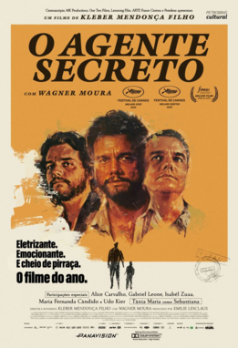

Shamelessly stealing from Steven Soderbergh's [Seen, Read blog](https://extension765.com/blogs/soderblog). Lets see how long I keep this up. This will be a place to work through rough ideas about media with limited copyediting.

### Seen, Read March 2026

**The Secret Agent**

A strong claim to the best film I’ve seen in a really long time. 
Wagner Moura is a certifiable great. 
It’s one of those films, like the ocean, that is little disorienting when you enter. It’s a whole other world, with two faced cats, and a police chief with a black son and a white one; character aplenty. From the very first scene you feel that you are missing a mountain of context and layers of symbolism and meaning, but trust that the current will pull you to an ending that is honest and true. As the credit roll you are baptised and made whole. Bravo!

**The Testament of Ann Lee**

The Testament of Ann Lee, to me, operates on three levels. One which works brilliantly, one which works occasionally, and one which is deeply flawed:

Level 1 → Pairs nicely with The Brutalist (written also by the pair of Fastvold and Corbet). Here we explore the myth of America: a land of opportunity for those seeking religious freedom. America as a flawed but ultimately enduring experiment is hard to miss as The Shakers journey across the Atlantic, settle on "virgin land", and are hear of the British defeat at Yorktown. We also see ways in which America has failed to live up to that myth, whether the inequality or the proliferation of hatred. Like The Brutalist, its genius is picking a perspective that pricks the smooth and easy myth. There a Jewish holocaust survivor and here a woman that believes she is the second person. Curiously both films are ultimately, perhaps fatalistically, hopeful. The building stands in the Brutalist and there are two Shakers in America.

Level 2 → The film does a decent job in capturing a level of subjectivity. You feel the draw of the Evangelical Revival; the lack of centralised authority post-Protestant Reformation giving anybody as good a claim as others to reach 'truth'. Even an illiterate woman from Manchester. Combine this with a growing disillusionment with salvation via accessing the scripture as a scholar and the allure of achieving personal conviction and the ground is prepped for something new. The choice to frame the film as narrated by a believer helps this in the first half, as is the relief the film transmits when someone confesses their deepest shame and is greeted with song and dance instead of condemnation. Addictive stuff. It doesn't quite go all the way with the narration (and film's framing) using the trip to America as a good time as any to allow the audience to laugh at the silly parts of Shakerism. It's a nice release valve halfway through the film, but I feel it undermines the sincerity you need to make a film that takes seriously a quasi-apocalyptic religious group.

Level 3 → I found the choice to limit the music to Shaker hymns valiant, and certain segments were particularly moving. But I did feel it didn't go far enough to take advantage of the medium of cinema. A lot probably comes down to budget. How much can you really do for $10 million when you also have to cross the Atlantic and build Mount Lebanon? Something I also noticed it shares with The Brutalist was a preference for close-ups, which hurts a film when it's used in musical performances. You have a group of trained dancers and a choreographer, but all we can see is two-thirds of Amanda Seyfried's face. Seyfried is doing the kind of big performances that probably should've gotten her more Awards praise, but even that can't carry this film to its finish line. 
Ultimately I am a big softy and cannot help but love the story of a group of people that sought, in their own way, to bring heaven to earth.

**Good Luck, Have Fun, Don’t Die**

Gore Verbinski made the best Pirates of the Caribbean films and Rango so has a lot of good will that this film, thankfully, doesn't spoil.
Curious to see a guy who built his reputation on big budget spectacle slumming it, but the charms of Sam Rockwell (amongst others), a nice tale about parents & children, and a clever (if bombastic) original script see me smiling when credits roll. 
The opening and closing sequence is the stuff of dreams. Happy to have more of these!
p.s. belongs in the Juror #2 category for sci-fi

**Peter Hujar’s Day**

There was a hint of a worry, upon discovering the film’s concept, that it would turn into a recording of a two-person play. It is shot and blocked with beauty and purpose that it remained a hint. 
Ben Whishaw dances under the burden he was given in the role. 
There is also a Mank quality to this; that I would better appreciate its nuance if I knew the details of the names it drops, but perhaps that’s a feature. A tale of a city where notoriety and clout can be its own currency right until you actually want to make a living. 
Maybe you can still be young and surrounded by art and music and still think about money.

### Seen, Read April 2026
