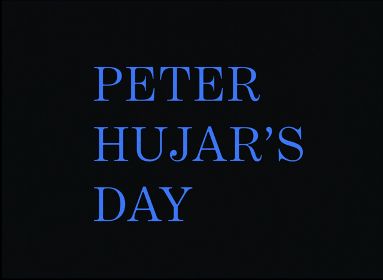
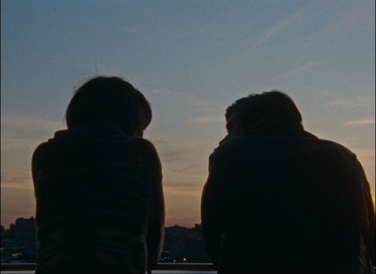
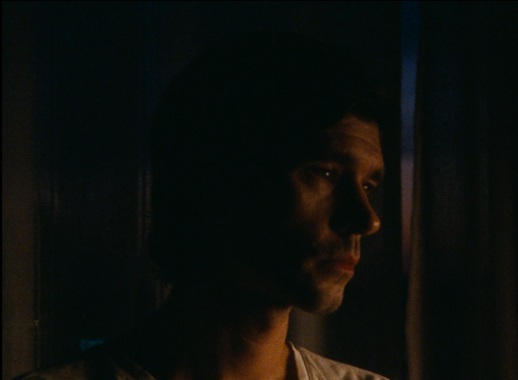
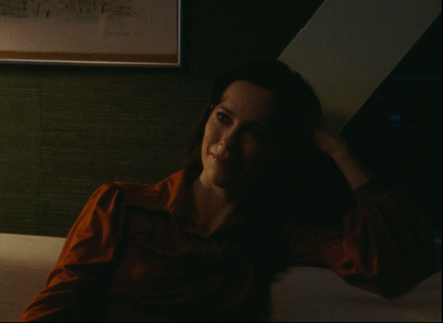

Shamelessly stealing from Steven Soderbergh's [Seen, Read blog](https://extension765.com/blogs/soderblog). Lets see how long I keep this up. This will be a place to work through rough ideas about media with limited copyediting.

### Seen, Read, Reviewed March 2026

**The Secret Agent**

A strong claim to the best film I’ve seen in a really long time. 
Wagner Moura is a certifiable great. 
It’s one of those films, like the ocean, that is little disorienting when you enter. It’s a whole other world, with two faced cats, and a police chief with a black son and a white one; character aplenty. From the very first scene you feel that you are missing a mountain of context and layers of symbolism and meaning, but trust that the current will pull you to an ending that is honest and true. As the credit roll you are baptised and made whole. Bravo!

**The Testament of Ann Lee**

The Testament of Ann Lee, to me, operates on three levels. One which works brilliantly, one which works occasionally, and one which is deeply flawed:

Level 1 → Pairs nicely with The Brutalist (written also by the pair of Fastvold and Corbet). Here we explore the myth of America: a land of opportunity for those seeking religious freedom. America as a flawed but ultimately enduring experiment is hard to miss as The Shakers journey across the Atlantic, settle on "virgin land", and are hear of the British defeat at Yorktown. We also see ways in which America has failed to live up to that myth, whether the inequality or the proliferation of hatred. Like The Brutalist, its genius is picking a perspective that pricks the smooth and easy myth. There a Jewish holocaust survivor and here a woman that believes she is the second person. Curiously both films are ultimately, perhaps fatalistically, hopeful. The building stands in the Brutalist and there are two Shakers in America.

Level 2 → The film does a decent job in capturing a level of subjectivity. You feel the draw of the Evangelical Revival; the lack of centralised authority post-Protestant Reformation giving anybody as good a claim as others to reach 'truth'. Even an illiterate woman from Manchester. Combine this with a growing disillusionment with salvation via accessing the scripture as a scholar and the allure of achieving personal conviction and the ground is prepped for something new. The choice to frame the film as narrated by a believer helps this in the first half, as is the relief the film transmits when someone confesses their deepest shame and is greeted with song and dance instead of condemnation. Addictive stuff. It doesn't quite go all the way with the narration (and film's framing) using the trip to America as a good time as any to allow the audience to laugh at the silly parts of Shakerism. It's a nice release valve halfway through the film, but I feel it undermines the sincerity you need to make a film that takes seriously a quasi-apocalyptic religious group.

Level 3 → I found the choice to limit the music to Shaker hymns valiant, and certain segments were particularly moving. But I did feel it didn't go far enough to take advantage of the medium of cinema. A lot probably comes down to budget. How much can you really do for $10 million when you also have to cross the Atlantic and build Mount Lebanon? Something I also noticed it shares with The Brutalist was a preference for close-ups, which hurts a film when it's used in musical performances. You have a group of trained dancers and a choreographer, but all we can see is two-thirds of Amanda Seyfried's face. Seyfried is doing the kind of big performances that probably should've gotten her more Awards praise, but even that can't carry this film to its finish line. 
Ultimately I am a big softy and cannot help but love the story of a group of people that sought, in their own way, to bring heaven to earth.

**Good Luck, Have Fun, Don’t Die**

* Gore Verbinski made the best Pirates of the Caribbean films and Rango so has a lot of good will that this film, thankfully, doesn't spoil.
* Curious to see a guy who built his reputation on big budget spectacle slumming it, but the charms of Sam Rockwell (amongst others), a nice tale about parents & children, and a clever (if bombastic) original script see me smiling when credits roll. 
* The opening and closing sequence is the stuff of dreams. Happy to have more of these!
* p.s. belongs in the Juror #2 category for sci-fi

**Peter Hujar’s Day**

   

There was a hint of a worry, upon discovering the film’s concept, that it would turn into a recording of a two-person play. It is shot and blocked with beauty and purpose that it remained a hint. 

Ben Whishaw dances under the burden he was given in the role. 

There is also a Mank quality to this; that I would better appreciate its nuance if I knew the details of the names it drops, but perhaps that’s a feature. A tale of a city where notoriety and clout can be its own currency right until you actually want to make a living. 

Maybe you can still be young and surrounded by art and music and still think about money.

### Seen, Read, Reviewed April 2026

**Crime 101**

You get the sense that the entire film was conceived backwards: the finale thought of first and the rest constructed to build up to it. The finale however, is so great that you understand why.

It is very much baby Heat and has a massive William Friedkin shrine in its bedroom, but there is something solid here: A respect and execution of the craft of well planned and shot chase scenes; a sincerity for its characters (perhaps overly so at times); and a grounding in the real city of Los Angeles. 

With the exception of the Barbaro plot-point, everybody is using their star power to imbue the characters they play with a depth that pops off the screen. Thank goodness that TV actor Pablo Pascal was replaced by the cinematic giant that is Mark Ruffalo.

p.s. Overjoyed that my personal fave Halle Berry is in a film that is both good and watchable.

**How to Make a Killing**

There is a moment when I thought this would turn out to be discount Hit Man without a compelling romance plot (Jessica Henwick is wasted as basically a walking part-time girlfriend/part-time conscience for the protagonist), but it won me over. Perhaps it's my fondness for Glen Powell or the originality of how the plot weaves over time, but I liked it. 

A great time at the cinema. 

Some spare thoughts:
* Would this be a stronger film without Margaret Qualley?
* Why was this film seemingly buried? (ah an A24 release! Makes sense now)
* Did not like the framing device of the confession to a priest, almost seems like a note given while editing to help move the plot along.
* Should really find sometime, based on a friend's recommendation, to watch Kind Hearts and Coronets

**The English Understand Wool, Helen DeWitt**

Wish the novella had the prestige in the Anglosphere it does in France. A charming and cleverly written story with a surprisingly density even if you can finish it in an hours or two

**The Silver Bone, Andrey Kurkov**

Kind of an oddly constructed book. A mystery novel, but the majority of its pages are spent following a young man adjust to a changing Ukraine. Though I will say that when the plot really begins it moves. Pleasant and well written, but I think I wanted slightly more. 

**The Drama**

Liked it a lot once the credits rolled. Liked it less since walking out of the cinema.

Theres a trick the film pulls in not letting conversations, sometimes important ones at important moments between important characters, finish. It cuts to the conclusion or splices in part of another scene. While this might help build a dreamlike or surreal tone in an otherwise grounded story, it robs the characters of depth and thus stakes. 

Who are these people? Why do they want to be/remain in each other's lives? Those are the questions the film is totally uninterested in asking. It uses the star power of its leads to lend an air of legitimacy to their characters (Pattinson is particularly great at playing quirky men) so you buy the relationship even when the film does no work in building it up. Movies do this all the time, but when The Drama now asks the audience to think 'big questions' about how new information would affect how you see your partners it falls apart. It is fun to see characters react to the forces pushing them in certain directions, but you might start to realise they moved so easily because there was never anything keeping them together.

**Project Hail Mary**

I can feel my emotional puppet strings being pulled, I know how Lord and Miller construct a joke enough to predict it, it probably needed once more draft to make the plot feel seamless. Loved in nonetheless. Ryan Gosling passes the Tom Hanks test: can a film mostly focusing on you acting alone still be entertaining? A resounding yes from me.

p.s. While I miss serious movie Ryan Gosling I would not say no to him as the lone human in a muppets film

**Amadeus (Theatrical Cut)**

Perhaps a decade ago, I watched the director's cut. Three hours later I came away loving it even if it was not an always pleasant watch. Now that the theatrical release is more available you really have to wonder what possessed them to poison the well with an inferior release. A real testament to the value of editing, for this watch flew by with a rhythm not found in the longer director's cut.

This might be the closest to Howard Hawks famous dictum that a great film has three good scenes and no bad ones. Salieri encountering Mozart for the first time, the Opera scenes, and the final composition are masterful even if they are aided by some of the best classical music has produced. In my first watch my eyes were on Hulce's Mozart, how could I not, and his impish performance contra the tropes of the child prodigy with the young Salieri's volcanic animosity kept under the surface. But this watch it was all on the older Salieri, his words and his actions, as he builds what is now the establish character of the mediocre moon in the presence of the resplendent sun. 

I wonder how much I would like this less with original music as opposed to some of my personal favourites. Lacrimosa especially but really everything from Requiem is almost a cheat code. Taking this in mind, is my love for this film because I read it more as a process film: the joy comes from Salieri recognising, beyond his peers and the court, the value of what he is listening to rather than appreciating the dramatic potential of someone who is able to recognise quality even as, in that moment, they realise how far they are from it. This would explain why the scene that sings to me is not Salieri in awe of the gulf, but the brief moment when he works with Mozart and gets to create with the maestro.

The good biopics, whether partly or wholly fictional, place you as an audience for the creation of the great work you admire. The great ones, on the other hand, puts you side by side so that, even for a moment, you feel the joy and pleasure found in the act of creation.
